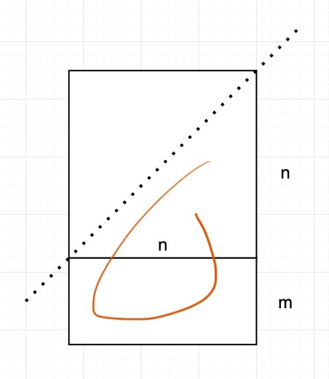

# 0829_consecutive-numbers-sum

数学问题.

给定一个数字`num`, 我们需要找到符合条件的`n`的个数:

- 对于这个`n`, 存在一个`m`, 使得`m*n + n*(n-1) / 2 == num`

一个**非离散的**图形表达如图, 上面的半个三角形, 加下边的矩形面积就是`num`.

其中`n`就相当于这个等差数列数字的个数, `m`相当于是等差数列的最小数字.

我们把这个思路转化为**离散的**的解法, 上面的半个三角形就变成了`n*(n-1)/2`

从`1`开始向大的数字遍历, 上限条件其实就是`n*(n-1)/2 <= num`
